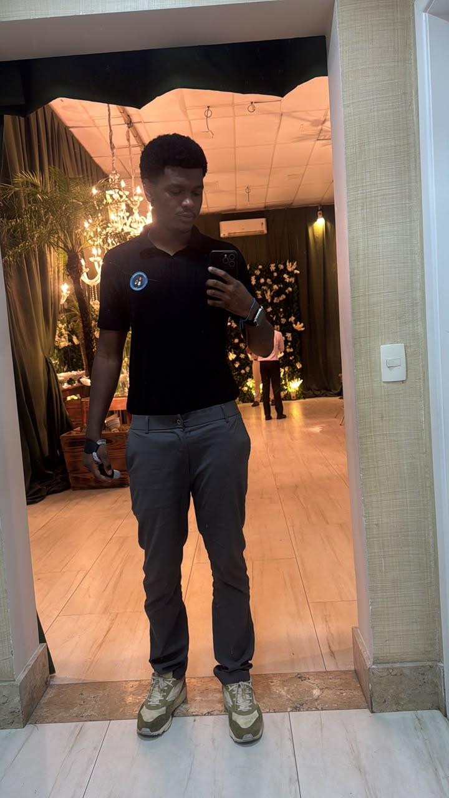

```{=html}
<style>
body {
  background-image: url('https://img.magnific.com/fotos-premium/mapa-mundi-com-textura-na-foto-de-satelite-global-visao-da-terra-vista-do-espaco_788189-2352.jpg');
  background-size: cover;
  background-position: center;
  background-attachment: fixed;
  margin: 0;
  padding: 0;
}

.container-home {
  background-color: rgba(255, 255, 255, 0.95);
  max-width: 800px;
  margin: 60px auto;
  padding: 50px 40px;
  border-radius: 10px;
  box-shadow: 0 4px 20px rgba(0, 0, 0, 0.15);
  text-align: center;
  margin-bottom: 60px;
}

.profile-image {
  width: 200px;
  height: 200px;
  border-radius: 50%;
  margin: 0 auto 30px;
  border: 5px solid #0056b3;
  object-fit: cover;
  box-shadow: 0 4px 15px rgba(0, 0, 0, 0.1);
}

.home-title {
  font-size: 2.5em;
  color: #0056b3;
  margin: 20px 0 30px 0;
  font-weight: bold;
}

.citation {
  font-size: 1.1em;
  font-style: italic;
  color: #e50914;
  margin: 25px 0;
  line-height: 1.6;
  border-left: 4px solid #0056b3;
  padding-left: 20px;
}

.home-text {
  font-size: 1.1em;
  color: #212529;
  line-height: 1.8;
  margin: 25px 0;
  text-align: justify;
}

.social-links {
  display: flex;
  justify-content: center;
  gap: 20px;
  margin-top: 30px;
  flex-wrap: wrap;
}

.social-links a {
  display: inline-flex;
  align-items: center;
  justify-content: center;
  width: 50px;
  height: 50px;
  border-radius: 50%;
  background-color: #0056b3;
  color: white;
  text-decoration: none;
  font-size: 1.2em;
  transition: all 0.3s ease;
}

.social-links a:hover {
  background-color: #e50914;
  transform: scale(1.1);
}
</style>

<div class="container-home">
  
  
  <h1 class="home-title">Iury Xavier</h1>
  
  <p class="home-text">
    Olá! Sou estudante de Engenharia de Agrimensura e Cartográfica na UFBA. Utilizo a tecnologia, o geoprocessamento e a análise de dados para mapear, compreender e transformar essas relações no espaço real.
  </p>

  <p class="citation">
    "O território não é apenas o conjunto de formas naturais e artificiais; é o território usado, o chão mais a identidade." — Milton Santos
  </p>
  
  <div class="social-links">
    <a href="https://github.com/iuryxavierr" title="GitHub">
      <i class="fab fa-github"></i>
    </a>
    <a href="https://www.linkedin.com/in/iury-xavier-a0ab78227/" title="LinkedIn">
      <i class="fab fa-linkedin"></i>
    </a>
    <a href="https://www.instagram.com/iuryxavierr/" title="Instagram">
      <i class="fab fa-instagram"></i>
    </a>
    <a href="mailto:iuryxavi3r@gmail.com" title="Email">
      <i class="fas fa-envelope"></i>
    </a>
  </div>
</div>
```
